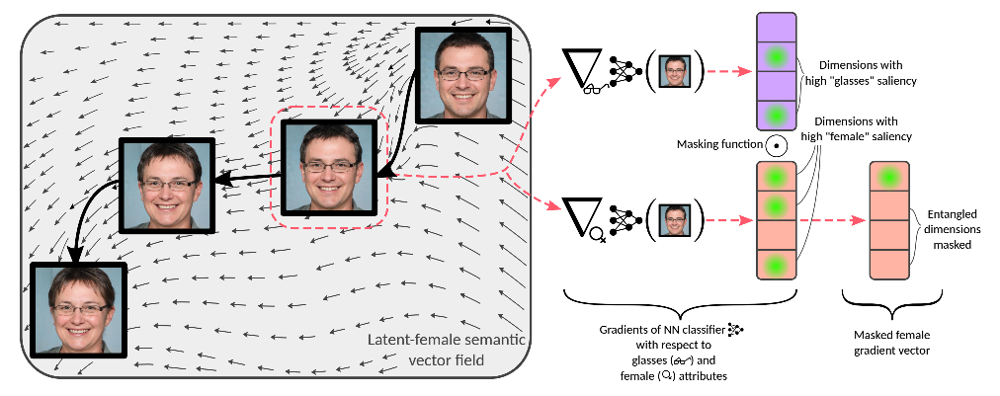
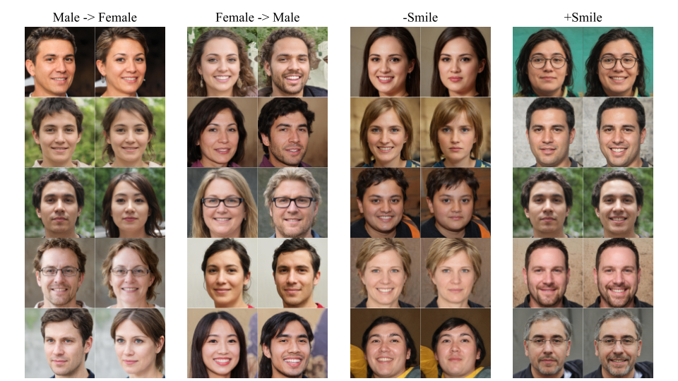
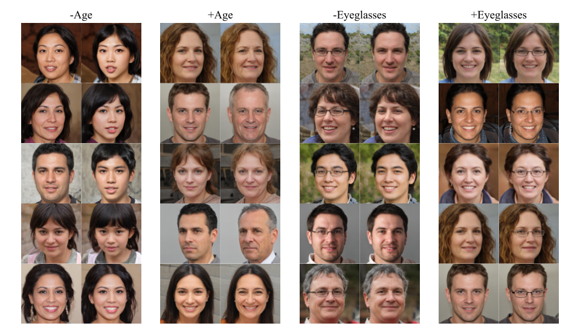
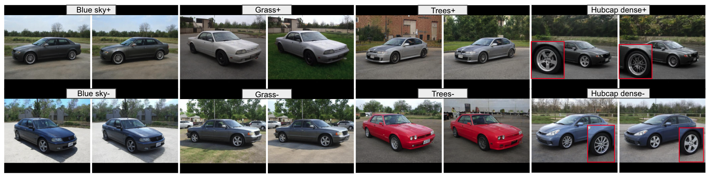
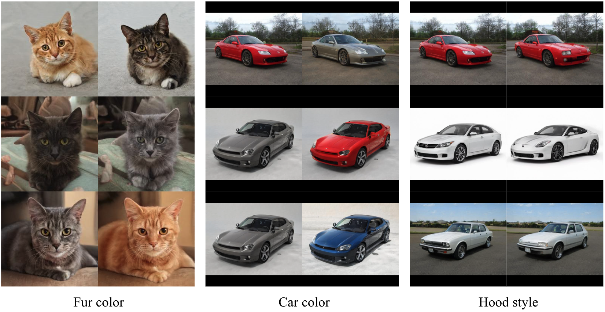

# Exploring Gradient-based Multi-directional Controls in GANs



**Figure:** *Our method's semantic interpolation in a nonlinear vector field.
Directions corresponding to the female semantic in GAN latent space (left) are determined by differentiating a simple neural network classifier (middle).
Disentanglement is achieved by masking channels of the female semantic gradient vector that are highly salient for non-target attributes such as glasses (right).*




**Figure:** *Binary attribute editing results for StyleGAN2-FFHQ, LSUN-Car.*

**Figure:** *Multi-attribute editing results for StyleGAN2-LSUN-Car, LSUN-Cat.*

## Manipulation Demo for StyleGAN2-FFHQ
We use the official StyleGAN2 repo (https://github.com/NVlabs/stylegan2) under `stylegan2`.
```
python manipulate.py \
--model_dir model_ffhq \
--attribute $ATTRIBUTE_NAME \
--out_dir out_ffhq
```
$ATTRIBUTE_NAME can be eyeglasses/age/gender/smile.

We also provide pretrained models for LSUN cats and cars with $ATTRIBUTE_NAME = color (for cats) or sky_blue/grassground/hubcap_dense (for cars). Specify `--model cat/car` and change the corresponding directories & attribute names to obtain the editing results.

## Usage
We use the official StyleGAN2 model trained on FFHQ dataset as an example.

### Prepare data

* Sample latent codes from $W$ space and the corresponding images with `python sample.py --out_dir $GAN_OUTPUT_DIRECTORY` 
* Use your own image classifier to obtain semantic scores for each attribute `$ATTRIBUTE_NAME` in all images, and save the outputs as `$GAN_OUTPUT_DIRECTORY/logits/logits_$ATTRIBUTE_NAME.pkl`. The outputs should be of shape ($NUM_SAMPLES, $NUM_CLASSES), e.g., for binary classification, $NUM_CLASSES = 1.
* Run `python prepare_data.py --data_dir $GAN_OUTPUT_DIRECTORY --out_dir $DATA_OUTPUT_DIRECTORY --attributes $ATTRIBUTE_NAME_1,ATTRIBUTE_NAME_2,...` to generate the training/validation sets for our model. 

### Train the model
* `python train.py --attributes $ATTRIBUTE_NAME_1,ATTRIBUTE_NAME_2,... --data_dir $DATA_OUTPUT_DIRECTORY --out_dir $MODEL_DIRECTORY` to learn editing directions for the specified attributes. 

<!-- For non-binary attributes, specify the number of classes with `--multiclass_classes`. -->

### Manipulate latent semantics
```bash
python manipulate.py 
 --input_dir $INPUT_DIRECTORY \
 --model_dir $MODEL_DIRECTORY \
 --attribute $ATTRIBUTE_NAME \
 --out_dir $EDIT_OUTPUT_DIRECTORY
 ```
To set the disentanglement parameters manually, specify `--exclude $ATTR1,ATTR2... --top_channels $ATTR1_CHANNEL,ATTR2_CHANNEL...`. 
<!-- To edit multiclass attribute, specify  -->